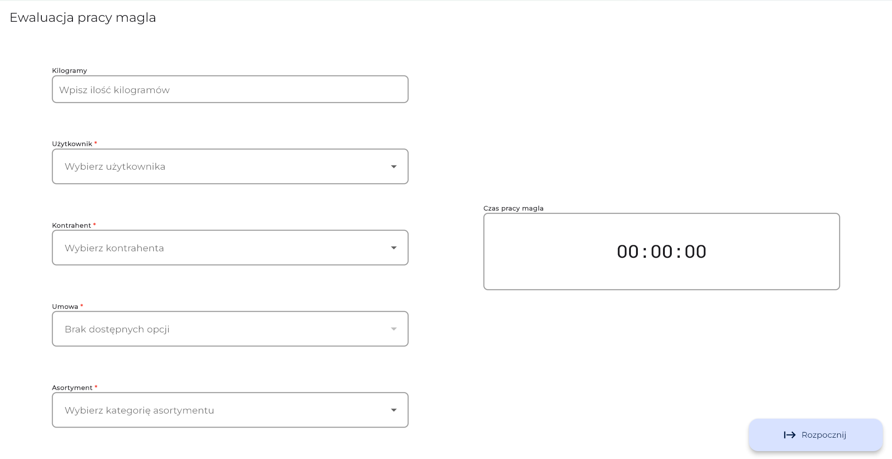

<h1>Workflow</h1>

 

<h3>"Workflow" to aplikacja Flutter zaprojektowana do zarządzania procesem pracy w usługach pralniczych poprzez monitorowanie i gromadzenie danych dotyczących prania klienta, oraz generowanie raportów na bieżąco dotyczących czasu obsługi i przerw w pracy magla.</h3>

 

### Nawigacja

[Specyfikacja projektu](#specyfikacja-projektu) | [Prezentacja UI](#prezentacja-ui) | [Funkcjonalności](#funkcjonalności) | [Wykorzystane techologie](#wykorzystane-technologie)

Przeczytaj w innym języku:
 

 

 
 

> [!WARNING]
> Ten projekt nie może być uruchomiony w obecnej postaci, ponieważ wymagane klucze API są powiązane z prywatnymi serwerami firmy, które nie mogą być udostępnione z powodu umów poufności.

## Specyfikacja projektu

Projekt jest aplikacją na tablety stworzona w celu usprawnienia zarządzania pracą w usługach pralniczych. Służy jako narzędzie do monitorowania i zbierania danych dotyczących czasu poświęconego na praniu dla każdego klienta, w tym czasu pracy i przerw.

Integrując się z interfejsem API, aplikacja pobiera dane klienta i przesyła raporty dotyczące czasu obsługi, długości oraz uzasadnienia przerw, poprawiając efektywność operacyjną i przejrzystość.

Aplikacja została napisana około dwóch lat temu na specjalne życzenie klienta. Ponieważ wtedy korzystałem głównie z setState do wszystkiego, można sobie wyobrazić, jak nieczytelny i trudny do utrzymania był kod. Około roku temu został on przepisany, wykorzystując architekturę Bloc.

 

## Prezentacja UI

 Zrzuty ekranu 

 

 

 

 

GIFy

 

 

 

## Funkcjonalności

Aplikacja zapewnia następujące funkcjonalności:

- **Integracja z Danymi Klienta**: Pobiera informacje o kliencie z interfejsu API dla łatwego dostępu.
- **Śledzenie Czasu**: Rejestruje czas potrzebny na przetworzenie prania dla każdego klienta.
- **Monitorowanie Przerw**: Utrzymuje śledzenie przerw, wliczając w to ich czas trwania i uzasadnienie.
- **Raportowanie Danych**: Wysyła raporty dotyczące czasu obsługi i przerw do zarządzania lub w celu zachowania dokumentacji do dalszego wykorzystania po stronie serwera.
- **Lokalne Przechowywanie Niekompletnych Raportów**: Wykorzystuje lokalne przechowywanie do zapisywania raportów z brakującymi informacjami. Mogą one zostać uzupełnione i sprawdzone przed przesłaniem na serwer, zapewniając dokładność i kompletność danych.

 

## Wykorzystane technologie

Ten projekt wykorzystuje następujące główne biblioteki:

- **Bloc** do zarządzenia stanami oraz struktury aplikacji: [Bloc on GitHub](https://github.com/felangel/bloc)
- **very_good_cli** do generacji projektu: [very_good_cli on GitHub](https://github.com/VeryGoodOpenSource/very_good_cli)
- **GoRouter** do nawigacji: [GoRouter on GitHub](https://github.com/csells/go_router)
- **Freezed** do generowania kodu modeli i serializacji: [Freezed on GitHub](https://github.com/rrousselGit/freezed)
- **Hive** do przechowywania danych lokalnie: [Hive on GitHub](https://github.com/hivedb/hive)
