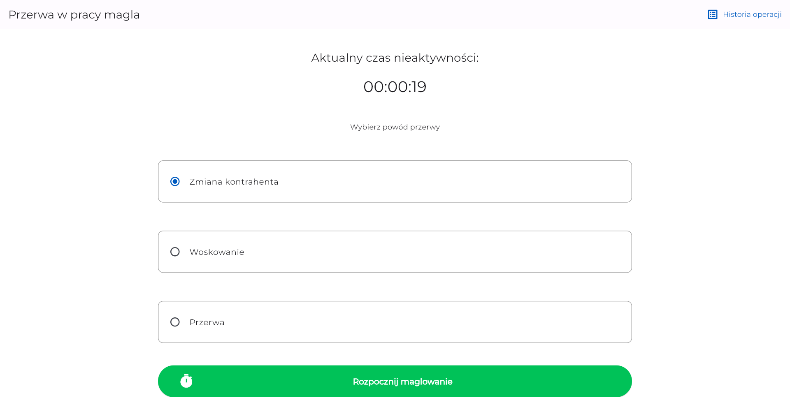
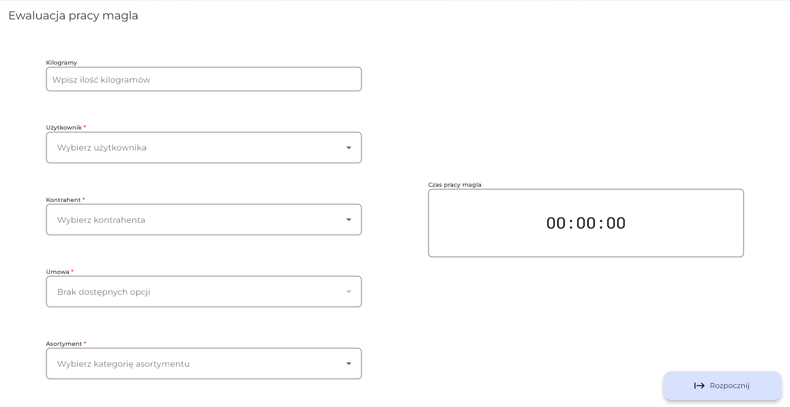
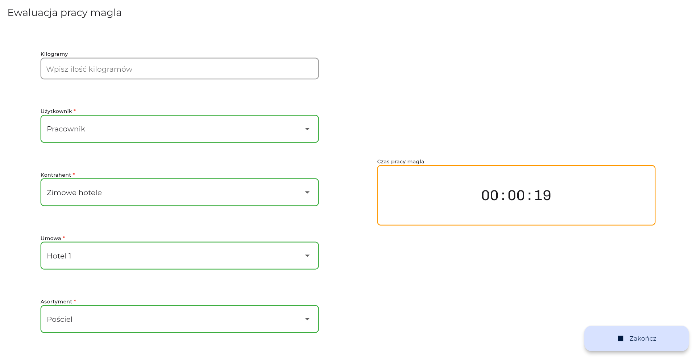
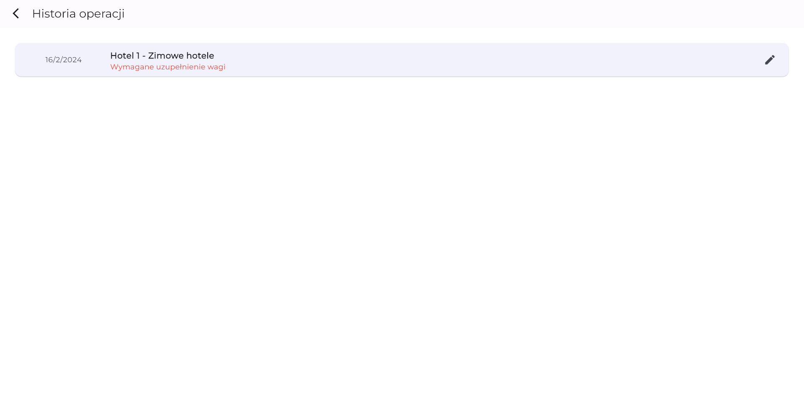

<h1>Workflow</h1>

 

<h3>Workflow is a Flutter application designed for workflow management in laundry services by monitoring and collecting data on client laundry, through real-time reporting on service times and breaks.</h3>

 

### Navigation

[Overview](#overview) | [UI Showcase](#ui-showcase) | [Features](#features) | [Technologies used](#technologies-used)

Read in different languages:
 

 

 

> [!WARNING]
> This project cannot be run as is because the required API keys are connected to private company servers, which cannot be shared due to confidentiality agreements.

 

## Overview

This project is a tablet-based application designed to streamline workflow management in laundry services. It serves as a tool for monitoring and collecting data on the time spent on each client's laundry, including work durations and breaks.

Integrating with an API, the application fetches client data and uploads reports on service times, break durations, and reasons for breaks, enhancing operational efficiency and transparency.

The app was first written roughly two years ago per client's request, as I was using setState for everything back then you can imagine how unreadable and unmaintable it was. About a year ago it was rewritten using Bloc architecture.

## UI Showcase

 Screenshots 

 

 

 

 

GIFs

## Features

- **Client Data Integration**: Fetches client information from an API for easy access.
- **Time Tracking**: Records how long each client's laundry takes to process.
- **Break Monitoring**: Keeps track of breaks, including how long they last and their reason.
- **Data Reporting**: Sends reports on service times and breaks back to the management or for record-keeping.
- **Local Storage for Incomplete Reports**: Utilizes local storage to save reports that have missing information. These can be completed and reviewed before being sent to the server, ensuring data accuracy and completeness.

## Technologies Used

This project leverages following major libraries:

- **Bloc** for state management: [Bloc on GitHub](https://github.com/felangel/bloc)
- **very_good_cli** for project generation: [very_good_cli on GitHub](https://github.com/VeryGoodOpenSource/very_good_cli)
- **GoRouter** for navigation: [GoRouter on GitHub](https://github.com/csells/go_router)
- **Freezed** for models code generation: [Freezed on GitHub](https://github.com/rrousselGit/freezed)
- **Hive** for local storage: [Hive on GitHub](https://github.com/hivedb/hive)
